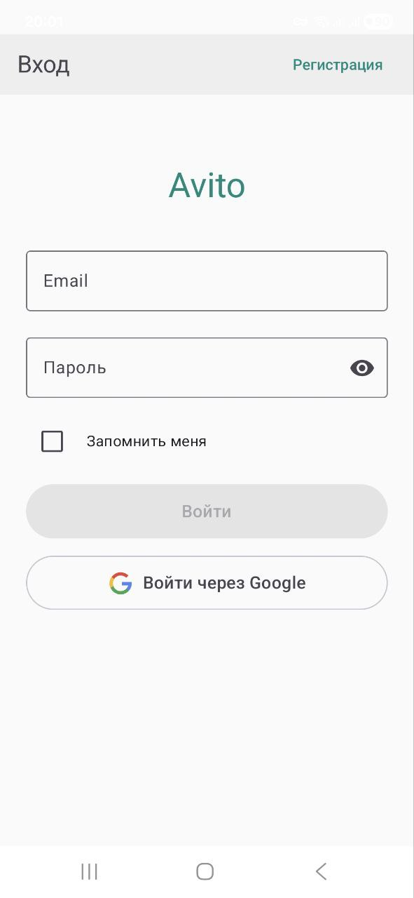
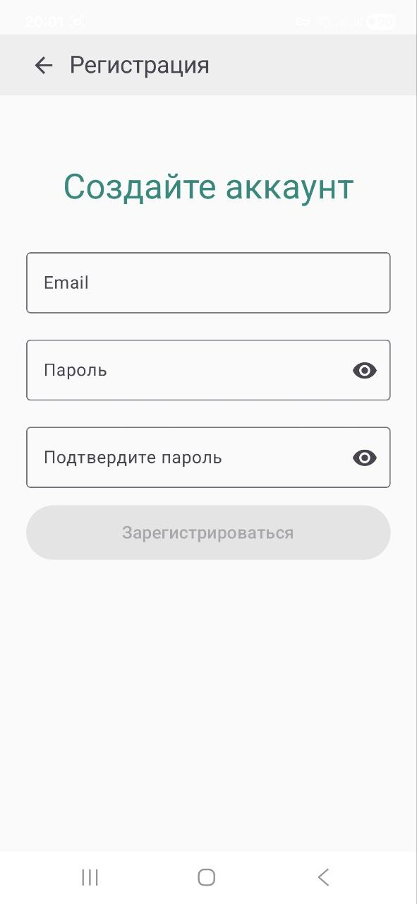
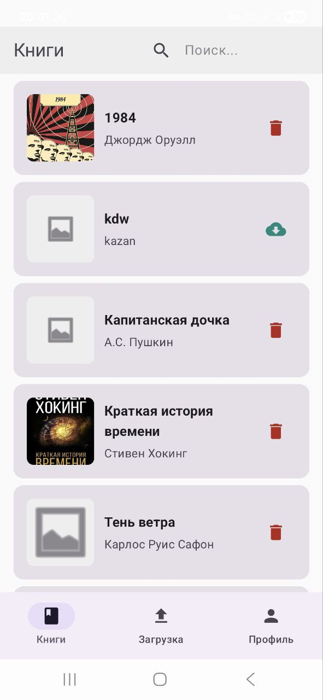
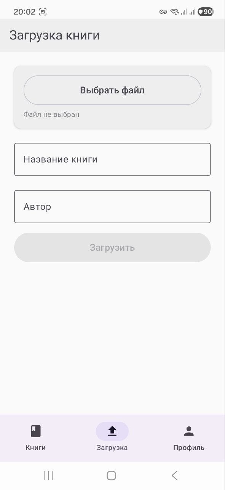

# AvitoReader - Приложение для чтения книг

Android-приложение для управления и чтения электронных книг с поддержкой различных форматов файлов.

## 📱 Описание

AvitoReader - это современное Android-приложение для чтения книг, которое позволяет пользователям:
- Просматривать список доступных книг
- Загружать книги из облачного хранилища
- Читать книги в различных форматах (TXT, PDF, EPUB)
- Управлять профилем пользователя
- Загружать собственные книги

## 🏗️ Архитектура

```
app/
├── core/                    # Основные модули
│   ├── ui/                 # UI компоненты и темы
│   ├── network/            # Сетевые утилиты
│   ├── firebase/           # Firebase конфигурация
│   ├── resources/          # Ресурсы и провайдеры строк
│   ├── model/              # Общие модели данных
│   └── util/               # Утилиты
│
└── feature/                # Функциональные модули
    ├── auth/               # Аутентификация
    │   ├── api/            # Публичные интерфейсы
    │   └── impl/           # Реализация
    ├── register/           # Регистрация пользователей
    │   ├── api/            
    │   └── impl/           
    ├── books/              # Управление книгами
    ├── reading/            # Чтение книг
    ├── profile/            # Профиль пользователя
    └── upload/             # Загрузка книг
```

## 🛠️ Технологический стек

### Основные технологии

- **Kotlin** 2.2.10
- **Android Gradle Plugin** 8.13.1
- **Jetpack Compose** (BOM 2025.11.00)
- **Material Design 3**
- **Dagger Hilt** 2.57.2 (Dependency Injection)
- **KSP** 2.2.10-2.0.2 (Kotlin Symbol Processing)

### Библиотеки

- **Firebase**
  - Authentication
  - Firestore
  - Storage

- **Navigation**
  - Navigation Compose 2.9.6
  - Hilt Navigation Compose 1.3.0

- **Сетевые запросы**
  - OkHttp 5.3.2
  - AWS SDK S3 2.25.0 (для Yandex Cloud Object Storage)

- **Чтение файлов**
  - PDFBox Android 1.8.10.3 (для PDF)
  - Jsoup 1.17.2 (для EPUB и HTML)

- **UI**
  - Coil 2.7.0 (загрузка изображений)
  - Lottie 6.1.0 (анимации)
  - Coroutines 1.10.2

## 📦 Модули

### Core модули

- **core:ui** - Переиспользуемые UI компоненты, темы
- **core:network** - Сетевые утилиты и конфигурация
- **core:firebase** - Firebase конфигурация и утилиты 
- **core:resources** - Провайдеры ресурсов
- **core:model** - Общие модели данных
- **core:util** - Утилиты и вспомогательные классы

### Feature модули

#### auth
- Аутентификация через Firebase
- Вход в систему
- Управление сессией пользователя
- Навигация на экран регистрации

#### register
- Регистрация новых пользователей
- Валидация email и пароля
- Подтверждение пароля
- Интеграция с Firebase Authentication

#### books
- Просмотр списка книг
- Поиск по книгам (по названию и автору)
- Загрузка книг из облачного хранилища (Yandex Storage Object)
- Удаление загруженных книг
- Pull-to-refresh для обновления списка (работает даже при пустом списке)
- Lottie анимации для пустых состояний

#### reading
- Чтение книг в форматах TXT, PDF, EPUB
- PDF: извлечение текста через PDFBox Android
- EPUB: ручной парсинг ZIP-архива с извлечением HTML через Jsoup
- Настройки чтения (размер шрифта, межстрочный интервал)
- Сохранение позиции чтения
- Управление прогрессом чтения

#### profile
- Просмотр и редактирование профиля
- Загрузка аватара
- Управление настройками аккаунта

#### upload
- Загрузка собственных книг
- Выбор файлов из устройства
- Валидация форматов файлов

## 🚀 Начало работы

### Требования

- Android SDK 24+ (минимальная версия)
- Android SDK 36 (target version)

### Тестовое устройство

Приложение было протестировано на:
- **Эмулятор**: Pixel 8 API 36 (Android 16)
- **Версия Android**: 16 (API Level 36)

> **Примечание**: Для проверки работы приложения рекомендуется использовать эмулятор или устройство с Android 7.0 (API 24) или выше.

### Установка

1. Клонируйте репозиторий:
```bash
git clone https://github.com/Nbveh25/ReaderApp.git
cd Avito
```

2. Настройте Firebase:
   - Создайте проект в Firebase Console
   - Добавьте `google-services.json` в папку `app/`
   - Настройте Firebase Authentication и Firestore

3. Настройте Yandex Cloud Object Storage:
   - Создайте бакет в Yandex Cloud
   - Настройте конфигурацию в соответствующих модулях

4. Синхронизируйте проект:
   - Откройте проект в Android Studio
   - Дождитесь завершения синхронизации Gradle

5. Запустите приложение:
   - Подключите устройство или запустите эмулятор
   - Нажмите Run или используйте `./gradlew installDebug`

## 🏃 Запуск

### Сборка debug версии
```bash
./gradlew assembleDebug
```

### Установка на устройство
```bash
./gradlew installDebug
```

## 📸 Демонстрация приложения

### Скриншоты

#### Основные экраны:

1. **Экран авторизации** (`AuthScreen`)
   - Вход по email и паролю
   - Кнопка перехода на регистрацию в TopBar
   - Валидация полей ввода в реальном времени
   - Кнопка "Войти через Google" (в разработке)
   - Чекбокс "Запомнить меня"
   
   

2. **Экран регистрации** (`RegisterScreen`)
   - Регистрация нового пользователя
   - Поля: Email, Пароль, Подтверждение пароля
   - Валидация всех полей
   - Кнопка "Назад" для возврата на экран логина
   
   

3. **Экран списка книг** (`BooksScreen`)
   - Список доступных книг с обложками
   - Поиск по названию и автору в TopBar
   - Pull-to-refresh для обновления (работает даже при пустом списке)
   - Lottie анимация при пустом списке
   - Загрузка/удаление книг через иконки на карточках
   - Индикатор загрузки при обработке действий
   
   
   

4. **Экран чтения** (`ReadingScreen`)
   - Чтение книг в форматах TXT, PDF, EPUB
   - Настройки шрифта и межстрочного интервала через BottomSheet
   - Сохранение позиции чтения
   - Прогресс-бар чтения
   
   

5. **Экран загрузки** (`UploadScreen`)
   - Выбор файла из устройства
   - Валидация формата (TXT, PDF, EPUB)
   - Загрузка на Yandex Cloud Object Storage
   - Индикатор прогресса загрузки
   
   

6. **Экран профиля** (`ProfileScreen`)
   - Информация о пользователе
   - Загрузка/изменение аватара
   - Выход из аккаунта
   
   

### Видео демонстрация


